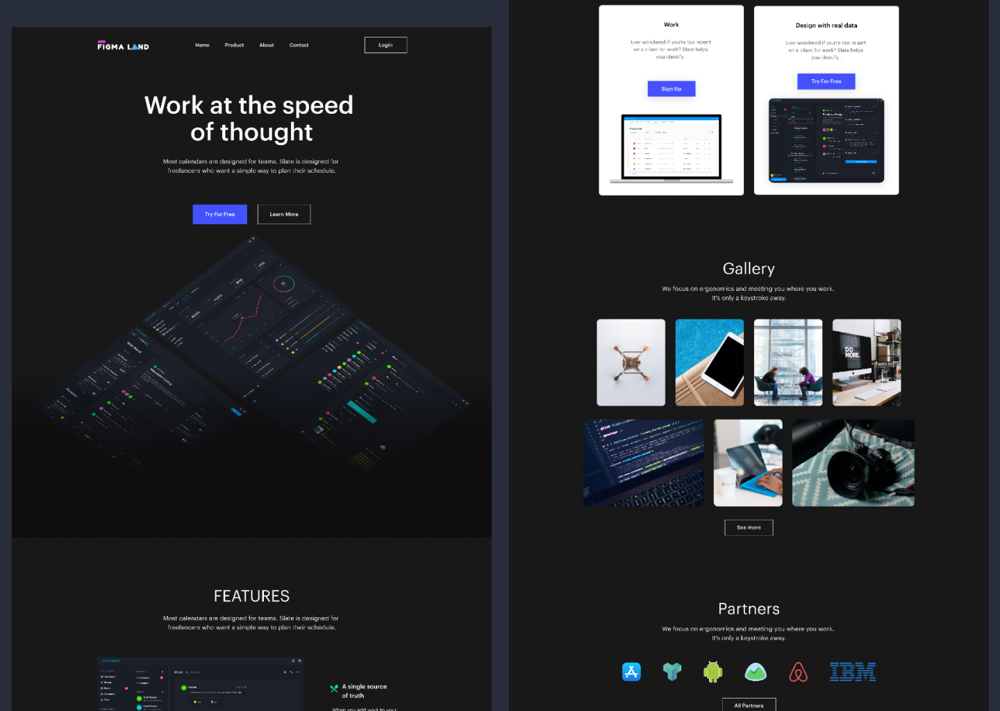

# Figma-landing-page-darkmode

>Front end Challenge 2 this is series of frontend challenge that am doing at [Dev.to Community](https://dev.to/t/frontendchallenge)

## Welcome! 👋

Thanks for checking out this front-end coding challenge.

**To do this challenge you need a basic understanding of HTML and CSS.**

## Where to find everything

Your task is to build out this landing page and get it looking as close to the design as possible. All the files needed are included in the `/project-folder` folder.

The designs are in Png with no backgound. This will mean that you'll need to use your best judgment for styles such as `font-size`, `padding` and `margin`. This should help train your eye to perceive differences in spacings and sizes.

The Design file(figma) is included in order to inspect the design in more detail you can [Check the Design Here](https://www.figma.com/file/3aS02Hza1dUAUzXfQ193nf/Figma-startup-landing-page-dark-Template?node-id=0%3A1).

You will find all the required images in the `/images` folder. Youn can Optimize the image if Needed.

## Building your project

Feel free to use any workflow that you feel comfortable with. Below is a suggested process, but do not feel like you need to follow these steps:

1. Clone the Repo (https://github.com/kelvinconrad/Figma-landing-page-darkmode.git)
2. Start the project
3. To host your Project you can use any services which are free eg: [Githubpages](https://pages.github.com/), [Zeit](https://vercel.com/), or [Netlify](https://www.netlify.com/). Personally i use Netlify.
4. **After finishing your project you can share it dev.to community by using the [#frontendchallenge](https://dev.to/t/frontendchallenge) hashtag**

**Have fun building!** 🚀

## Creator

Kelvin Conrad – [Twitter](https://twitter.com/Klvnconrad) – klvnconrad@gmail.com

## Contributing

1. Fork it (<https://github.com/kelvinconrad/Figma-landing-page-darkmode.git/fork>)
2. Create your feature branch (`git checkout -b my-new-feature`)
3. Commit your changes (`git commit -am 'Add some feature'`)
4. Push to the branch (`git push origin my-new-feature`)
5. Create a new Pull Request